# RelayOps

**Evidence-backed, policy-governed webhook recovery operations.**

RelayOps is a customer-facing webhook operations portal for investigating delivery failures and safely recovering missed events.

It helps integration teams move from:

```text
A webhook failed. Retry it.
```

to:

```text
What happened?
What remains uncertain?
Is another attempt safe?
Who is authorized to request it?
What evidence should be retained afterward?
```

> **RelayOps turns webhook delivery failures into evidence-backed, policy-governed recovery workflows.**

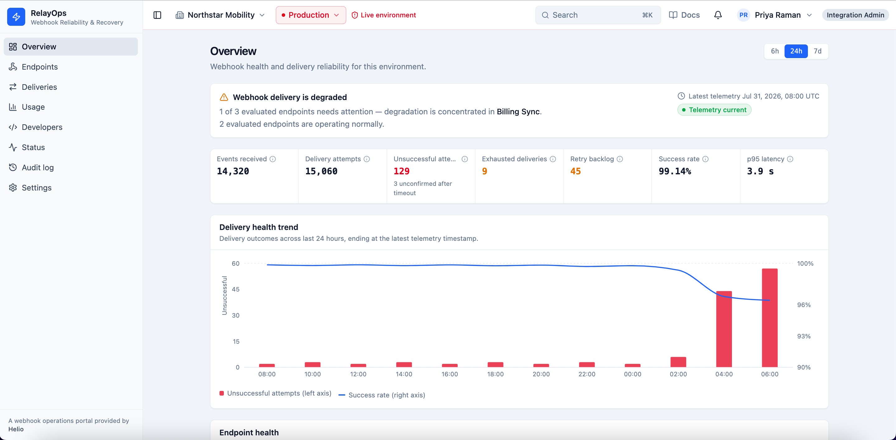
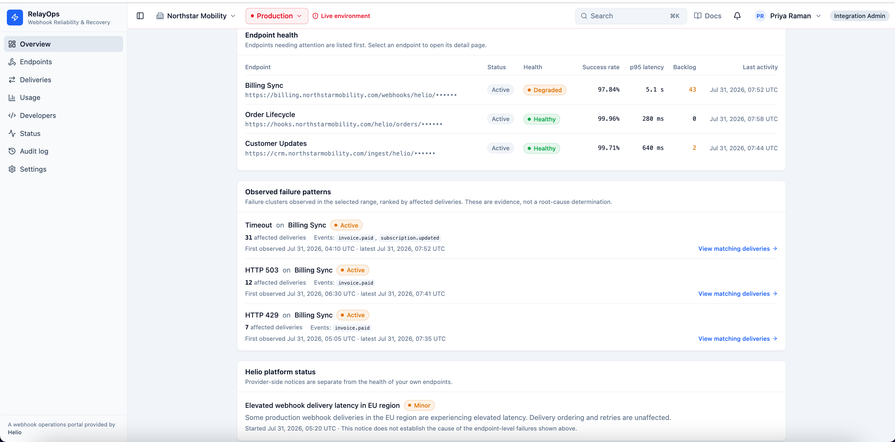

## Product overview

RelayOps is presented as part of Helio, a fictional subscription-commerce platform.

The example customer, Northstar Mobility, uses webhooks for events such as `invoice.paid`, where missing or duplicating an event could affect downstream subscription entitlements.

RelayOps provides:

- Production and Sandbox operational monitoring
- Endpoint-health investigation
- Delivery search and filtering
- Attempt-by-attempt delivery evidence
- Deterministic delivery assessment
- Explainable replay eligibility
- Role-aware replay authorization
- Contextual operator acknowledgements
- Idempotent replay-command creation
- Simulated asynchronous replay execution
- Recovery-aware delivery classification
- Read-only operational audit traceability

No real webhook request is sent. Replay execution is explicitly simulated, and replay state is stored only within the current browser session.

## Why this project exists

Webhook dashboards commonly provide:

- Success-rate charts
- Endpoint lists
- Delivery logs
- Status filters
- A retry button

Those capabilities help operators find a failure, but they do not answer the harder recovery question:

> Under what evidence and policy conditions should an operator be allowed to create another delivery attempt?

A failed-looking webhook is not automatically safe to replay.

The sender may know that:

- A request timed out
- A connection failed
- The receiver returned an HTTP error
- Automatic retries were exhausted

The sender may not know whether:

- The receiver processed the request before the connection failed
- A downstream transaction committed
- The receiver is healthy now
- The receiver safely deduplicates repeated events
- A displayed assessment remains valid when execution begins

RelayOps treats these uncertainties as product and system-design concerns rather than hiding them behind a generic retry action.

## Target users

### Integration administrator

The primary operator responsible for webhook health and recovery.

They need to:

- Identify affected endpoints and deliveries
- Understand the evidence behind a failure
- Determine whether recovery is currently permitted
- Acknowledge contextual replay risks
- Initiate and trace recovery actions

### Integration developer

The developer investigating receiver behavior and configuration.

They need to:

- Inspect sanitized request and response evidence
- Review attempt timing and retry history
- Understand authentication, signature, or receiver-health signals
- Distinguish observed facts from possible explanations
- Navigate between endpoints, deliveries, and replays

### Platform support operator

The internal or customer-facing operator supporting difficult cases.

They need to:

- Trace actions across related resources
- Understand who requested recovery and under which role
- Review recorded and simulated provenance
- Inspect replay lifecycle evidence
- Avoid making unsupported root-cause claims

## Product principles

### Evidence before action

Replay eligibility is derived from canonical delivery, endpoint, retry, payload, incident, replay-history, and role facts.

A failed status alone is insufficient.

### Unknown is a real state

A missing receiver response is not treated as a confirmed rejection.

If receiver acceptance remains unknown, RelayOps blocks replay because another attempt could duplicate a side effect that already occurred.

### Deterministic systems govern consequential actions

Replay authorization uses explicit, reproducible policy.

The operator can inspect:

- The delivery classification
- The eligibility result
- Every blocking or permitting rule
- The required acknowledgement
- The relevant evidence

### Recovery does not rewrite history

The original delivery attempts remain unchanged after replay.

A successful replay becomes separate recovery evidence, and the aggregate delivery classification changes to `recovered_by_replay`.

### Authorization uses current facts

Eligibility is revalidated when the command is submitted and again before simulated execution.

An earlier screen render is not treated as permanent authority.

### Auditability is part of the workflow

Replay requests, lifecycle transitions, outcomes, actors, acknowledgements, provenance, and related resources are represented as operational evidence.

### Simulation remains explicit

The prototype demonstrates stateful workflow behavior without claiming real webhook execution, durable backend persistence, or compliance-grade audit retention.

## Core workflow

```text
Observe → Investigate → Assess → Acknowledge → Request → Execute → Reconcile → Audit
```

### 1. Observe

The Production overview highlights:

- Delivery volume
- Delivery and retry health
- Degraded endpoints
- Failure clusters
- Relevant platform incidents
- Telemetry freshness

### 2. Investigate

The operator moves from the overview into the delivery explorer and then into a specific delivery.

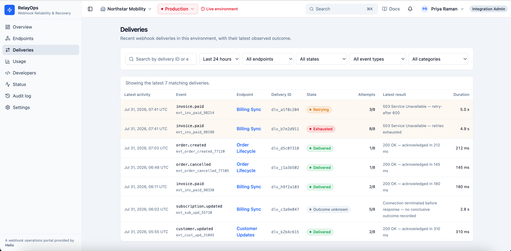

Delivery detail exposes:

- Event and endpoint context
- Original delivery status
- Attempt chronology
- Confirmed HTTP responses
- Response-absent transport evidence
- Sanitized request and response content
- Payload-retention state
- Retry-policy state
- Related resources

### 3. Assess

RelayOps resolves canonical facts and produces a deterministic assessment.

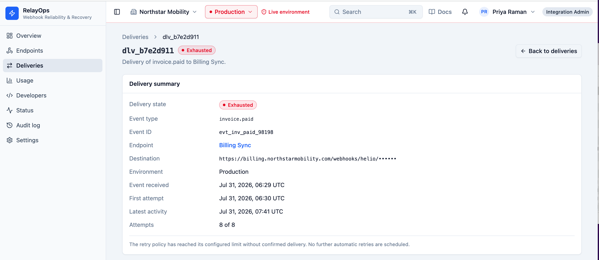
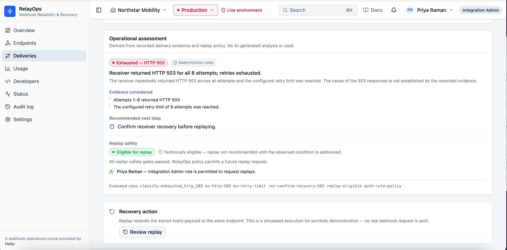

The assessment separates:

- What was observed
- What can be concluded
- What remains unknown
- What should be investigated next
- Whether replay is allowed
- Which acknowledgement is required

### 4. Acknowledge

An eligible operator must accept a contextual acknowledgement before requesting replay.

The acknowledgement does not claim that replay is risk-free. It captures the remaining decision that the system cannot independently establish, such as confirmation that a receiver has recovered.

### 5. Request

Replay is created through an explicit command boundary.

The command revalidates:

- Workspace and environment
- Delivery and endpoint existence
- Automatic retry state
- Payload availability
- Incident blockers
- Existing replay history
- Current operator role
- Required acknowledgement
- Idempotency-key semantics

### 6. Execute

The prototype creates a single replay job and item and advances them through a simulated asynchronous lifecycle:

```text
Queued → Running → Completed
                 ↘ Failed
                 ↘ Skipped
```

The job and item transition atomically within the browser-session persistence boundary.

### 7. Reconcile

After the replay reaches a terminal state, RelayOps reconciles the aggregate delivery assessment.

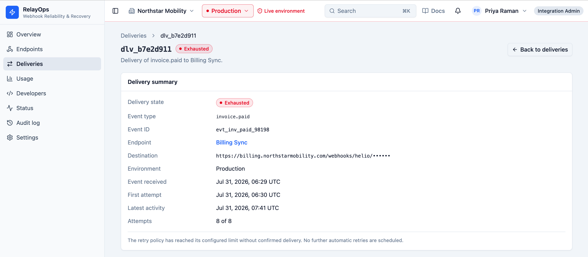
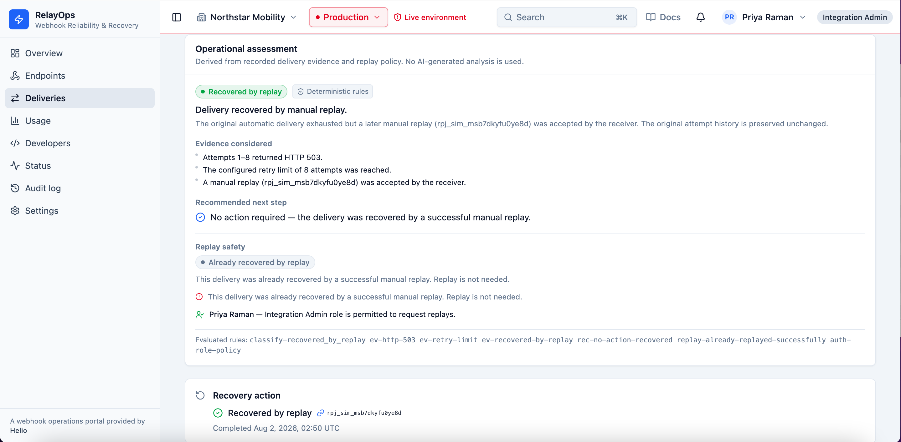

A completed replay can produce `recovered_by_replay`, while:

- Original attempts remain exhausted
- The replay remains separately addressable
- The recovery outcome retains simulated provenance
- Another successful replay is blocked

A failed replay remains failure evidence and does not create a false recovery classification.

### 8. Audit

Replay lifecycle events are projected deterministically from canonical replay state.

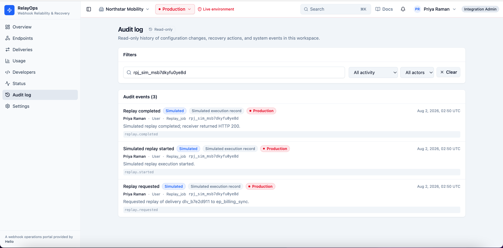

The Audit log supports:

- Requested, started, completed, failed, and skipped events
- Actor and role resolution
- Production and Sandbox isolation
- Workspace-wide governance records
- Recorded-versus-simulated provenance
- Stable event identifiers
- Direct links to related deliveries, endpoints, and replay jobs

The Audit log is a read-only operational projection, not a compliance-grade immutable ledger.

## Screenshot evidence

The repository contains nine screenshots that together show the complete RelayOps product narrative.

| # | Screenshot | Product evidence |
|---|---|---|
| 1 | [`01-production-overview.png`](docs/screenshots/01a-production-overview.png) <br> [`01-production-overview.png`](docs/screenshots/01b-production-overview.png) | Production telemetry, endpoint health, failure clusters, and product structure |
| 2 | [`02-delivery-explorer.png`](docs/screenshots/02-delivery-explorer.png) | Operational delivery search, filters, and mixed delivery outcomes |
| 3 | [`03-delivery-assessment.png`](docs/screenshots/03-delivery-assessment.png) | Attempt evidence, deterministic assessment, and replay eligibility |
| 4 | [`04-replay-acknowledgement.png`](docs/screenshots/04-replay-acknowledgement.png) | Contextual acknowledgement, simulation disclosure, and replay request |
| 5 | [`05-recovered-delivery.png`](docs/screenshots/05-recovered-delivery.png) | Recovery through a separate replay without rewriting original attempts |
| 6 | [`06-replay-detail.png`](docs/screenshots/06-replay-detail.png) | Replay lifecycle, operator, acknowledgement, execution evidence, and provenance |
| 7 | [`07-audit-trace.png`](docs/screenshots/07-audit-trace.png) | Requested, started, and completed replay lifecycle events |
| 8 | [`08-ambiguous-outcome-blocked.png`](docs/screenshots/08-ambiguous-outcome-blocked.png) | Unknown receiver acceptance and duplicate-side-effect blocker |
| 9 | [`09-sandbox-failed-replay.png`](docs/screenshots/09-sandbox-failed-replay.png) | Sandbox HTTP 401 replay failure retained without false recovery |

The main README emphasizes six screenshots that communicate the central workflow. The remaining three stay in the repository as supporting evidence for the acknowledgement, replay-detail, and failed-recovery states.

## Canonical scenarios

### Scenario 1: Confirmed temporary failure followed by successful recovery

Production delivery `dlv_b7e2d911` contains eight confirmed HTTP 503 attempts.

RelayOps can establish that:

- The receiver explicitly rejected each attempt with HTTP 503
- Automatic delivery exhausted its retry policy
- The original payload remains available
- The endpoint is active
- No active or successful replay already exists
- The operator has permission to request replay

The system cannot independently establish whether the receiver is now healthy.

The operator must acknowledge that receiver recovery has been confirmed. The simulated replay then completes with HTTP 200 acceptance.

Afterward:

- Original attempts remain exhausted
- Replay evidence remains separate
- The delivery becomes `recovered_by_replay`
- A second successful replay is blocked
- The replay lifecycle appears in the Audit log

### Scenario 2: Receiver acceptance remains unknown

Production delivery `dlv_c3a9e047` contains response-absent transport evidence.

The system cannot establish whether the receiver processed the original request.

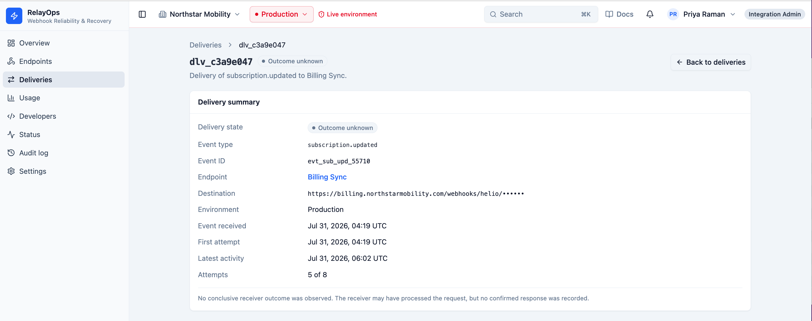
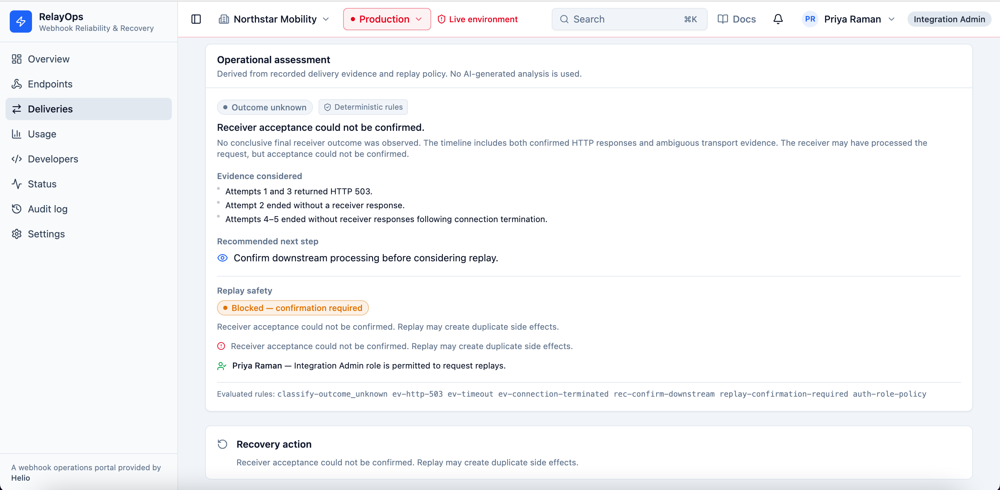

Replay is blocked because another attempt could duplicate a side effect that already occurred.

This scenario demonstrates that the safest product behavior can be refusal to act.

### Scenario 3: Confirmed authentication-related rejection followed by another rejection

Sandbox delivery `dlv_g6e1c750` contains eight confirmed HTTP 401 attempts with signature-verification-related response evidence.

RelayOps recommends checking authentication and signature configuration without claiming which side is responsible.

The simulated replay also returns HTTP 401.

The failed result is retained as factual replay evidence, but:

- The delivery is not classified as recovered
- The original history remains unchanged
- The product does not invent a definitive root cause
- Production state remains isolated from the Sandbox replay

## Delivery assessment model

RelayOps models delivery state more precisely than a binary success/failure label.

Representative classifications include:

- `delivered`
- `retrying`
- `exhausted`
- `ambiguous_outcome`
- `recovered_by_replay`
- `unavailable`

Replay policy evaluates canonical evidence such as:

- Receiver-response certainty
- Automatic retry completion
- Endpoint state
- Payload availability
- Delivery-reference integrity
- Relevant incident state
- Existing active replay
- Existing successful replay
- Operator role
- Parent-item replay coherence

Missing or contradictory evidence fails closed.

## Architecture

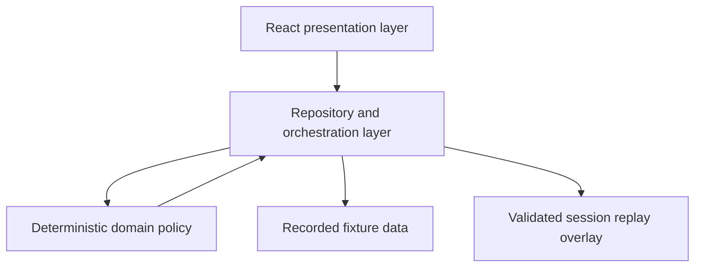

### Presentation layer

Pages and components render repository-supplied view models and aggregates.

They do not independently:

- Join fixture records
- Resolve replay history
- Determine authorization
- Reconstruct audit lifecycle
- Mutate original delivery evidence

### Repository and orchestration layer

The repository owns:

- Workspace and environment scoping
- Canonical fact resolution
- Delivery and endpoint lookup
- Replay-history aggregation
- Command validation
- Replay creation and transitions
- Lifecycle reconciliation
- Recovery-aware read models
- Audit projection
- Related-resource resolution

Repository functions are asynchronous even though the current implementation uses local data. This preserves a credible migration path to backend APIs.

### Deterministic domain layer

The domain layer owns:

- Delivery classification
- Replay eligibility
- Eligibility blockers
- Role policy
- Contextual acknowledgement selection
- Idempotency semantics
- Replay parent-item coherence
- Audit-event projection

These rules are kept outside route components so the same behavior applies across delivery detail, replay detail, and audit views.

### Recorded fixtures

Fixture data represents canonical historical evidence, including:

- Workspaces and memberships
- Production and Sandbox environments
- Endpoints
- Deliveries and attempts
- Retry policies
- Incidents
- Payload-retention states
- Historical replay records
- Recorded audit events

### Session replay overlay

New simulated replay jobs and items are stored in `sessionStorage`.

Before restored state can affect assessment or audit projection, RelayOps validates:

- Schema version
- Workspace
- Environment
- Source delivery
- Parent-item relationship
- Lifecycle state
- Counts
- Timestamps
- Outcome
- Execution evidence
- Idempotency key
- Acknowledgement

Malformed or contradictory restored data is rejected.

## System boundaries

| Concern | Prototype implementation | Production replacement |
|---|---|---|
| Authentication | Fixed fixture-backed user and membership | Authenticated identity and server-side membership resolution |
| Delivery data | Recorded local fixtures | Server-side delivery repository |
| Replay authorization | Deterministic client-side domain policy | Server-side policy enforcement |
| Replay persistence | Validated browser `sessionStorage` | Durable transactional database |
| Replay execution | Deterministic simulation adapter | Queue-backed worker |
| Idempotency | Workspace-scoped persisted replay lookup | Durable idempotency records and transactional locking |
| Lifecycle | Repository-owned simulated transitions | Worker-owned state machine |
| Payload access | Sanitized fixture evidence | Secure payload retrieval with access control |
| Signing | Not implemented | Server-side secret management and request signing |
| Audit | Recorded fixtures plus deterministic projection | Durable events emitted through an outbox or equivalent |
| Concurrency | Modeled through policy and coherence rules | Database constraints, locking, and rate controls |
| Environment isolation | One global client context | Server-enforced tenant and environment scoping |

The frontend should never directly possess the signing secrets, raw customer payloads, or authority required to execute a production replay.

## Key product decisions

### Replay is a command, not a direct state mutation

Requesting replay creates a separately identifiable job.

It does not append another attempt to the original delivery or change historical attempt evidence.

### Ambiguous receiver outcomes block replay

A timeout or missing response does not prove rejection.

If receiver acceptance is unknown, RelayOps does not authorize another potentially duplicative side effect.

### Automatic retries must finish first

Manual recovery is blocked while automatic delivery remains active.

This avoids competing retry paths and unclear ownership of the eventual outcome.

### Successful or active replays block another replay

An active replay prevents concurrent recovery.

A successful replay prevents unnecessary duplicate recovery.

A failed replay remains evidence but does not automatically prove that another replay is safe.

### Idempotency distinguishes equivalent and conflicting reuse

Equivalent reuse of an idempotency key can return the existing command result.

Reuse of the same key for a different command is rejected.

This is stronger than merely disabling a button after the first click.

### Safety is revalidated at execution time

The system reassesses current facts before command creation and before simulated execution.

A stale eligible view does not permanently authorize replay.

### Parent and replay-item state changes are atomic

The prototype writes the replay parent and its item together.

If browser persistence fails, the previously coherent state remains available.

### Audit events are projected from canonical replay state

RelayOps does not maintain an independently mutable second lifecycle inside the Audit log.

Stable projected events are derived from replay facts.

### Original attempts remain immutable after recovery

Successful recovery becomes additional evidence.

The product does not rewrite a previously exhausted delivery into a historically successful one.

### One environment context scopes the product

Production or Sandbox is selected globally.

The selected environment scopes:

- Overview telemetry
- Endpoints
- Deliveries
- Replay history
- Audit events
- Resource resolution
- Idempotency evaluation

Pages do not introduce conflicting independent environment selectors.

## Failure and degraded states

RelayOps includes explicit behavior for:

- Loading data
- Empty filtered results
- Repository errors
- Unknown resources
- Wrong-environment resource identifiers
- Stale telemetry
- Insufficient telemetry
- Disabled endpoints
- Expired or redacted payloads
- Missing canonical references
- Active automatic retry
- Ambiguous receiver acceptance
- Unauthorized operator role
- Missing acknowledgement
- Idempotency conflicts
- Active replay conflicts
- Existing successful replay
- Persistence failure
- Malformed restored state
- Contradictory parent-item state
- Simulated replay failure
- Simulated replay skip

The system fails closed when required safety evidence is missing or incoherent.

## Recorded and simulated provenance

RelayOps contains two intentionally different evidence sources.

### Recorded

Recorded data represents historical fixture-backed platform evidence.

Examples include:

- Original webhook attempts
- Endpoint telemetry
- Historical replay records
- Platform incidents
- Workspace-wide governance events

### Simulated

Simulated data is created during the current browser session.

Examples include:

- Newly requested replay jobs
- Replay lifecycle transitions
- Simulated HTTP outcomes
- Projected replay audit events

The UI labels provenance so simulated execution is not mistaken for a real provider write or historical production event.

## AI boundary

RelayOps does not use AI in its implemented workflow.

This is deliberate.

Replay authorization requires:

- Stable rules
- Reproducible decisions
- Current canonical facts
- Inspectable blockers
- Conservative behavior under uncertainty

An LLM would not improve this authority boundary.

A future production product could use AI for low-authority assistance such as:

- Summarizing long attempt histories
- Grouping similar failures
- Drafting support notes
- Explaining deterministic policy in customer-friendly language
- Suggesting documentation and investigation steps

AI should remain outside:

- Canonical execution facts
- Role authorization
- Replay eligibility
- Idempotency enforcement
- Blocker overrides
- Terminal lifecycle outcomes

## Technology

- React 19
- TypeScript
- Vite
- React Router
- Tailwind CSS
- Radix UI and shadcn-style components
- Recharts
- Lucide icons
- Browser `sessionStorage` for simulated replay persistence

## Run locally

### Requirements

- Node.js
- npm

### Install dependencies

```bash
npm install
```

### Start the development server

```bash
npm run dev
```

Open the local URL displayed by Vite.

### Type-check

```bash
npm run typecheck
```

### Create a production build

```bash
npm run build
```

### Preview the production build

```bash
npm run preview
```

## Recommended evaluation walkthrough

For the clearest product demonstration:

1. Open the Production operational overview.
2. Review delivery health, degraded endpoints, and incident context.
3. Open the Delivery explorer.
4. Inspect Production delivery `dlv_b7e2d911`.
5. Compare original attempt evidence with the deterministic assessment.
6. Open the replay dialog and review the contextual acknowledgement.
7. Request the simulated replay.
8. Observe the replay lifecycle.
9. Return to the delivery and verify `recovered_by_replay`.
10. Confirm that the original attempts remain unchanged.
11. Open the replay detail and review execution evidence and provenance.
12. Open the Audit log and trace the requested, started, and completed events.
13. Inspect Production delivery `dlv_c3a9e047`.
14. Confirm that unknown receiver acceptance blocks replay.
15. Switch to Sandbox.
16. Replay `dlv_g6e1c750`.
17. Confirm that the simulated HTTP 401 remains failure evidence.
18. Verify that the failed replay does not create a recovered classification.

This walkthrough demonstrates:

```text
Successful recovery
Failed recovery
Recovery blocked because the outcome is ambiguous
```

## Prototype limitations

RelayOps is a portfolio prototype, not a production webhook platform.

### No backend authority

All behavior runs in the browser.

The frontend cannot safely own production replay authority, signing secrets, or customer payloads.

### No real webhook execution

Replay outcomes are deterministic simulations.

No request is sent to a customer endpoint.

### No durable multi-user persistence

New replay state lasts only for the browser session.

It is not shared across users, devices, or independent browser tabs.

### No distributed concurrency

The prototype models active-replay and idempotency protections but cannot reproduce distributed commands, database locking, or worker contention.

### No real worker

Lifecycle transitions are reconciled through repository-owned browser behavior rather than a durable queue and worker.

### No replay-network ambiguity

The simulation produces known outcomes.

A production executor would also need to handle cases where the request may have reached the receiver but the sender cannot confirm the result.

### No interactive bulk recovery

RelayOps preserves a historical bulk replay summary but does not expose bulk replay creation.

A credible bulk workflow would require:

- Per-item eligibility
- Rate controls
- Partial authorization
- Mixed outcomes
- Cancellation semantics
- Item-level retry
- Larger-blast-radius governance

### No compliance-grade audit export

The Audit log is operational and read-only.

It does not provide durable retention, tamper protection, completeness guarantees, signing, or compliance export.

### No automated test suite

The prototype was verified through:

- TypeScript checking
- Production builds
- Canonical workflow execution
- Adversarial state checks
- Cross-environment regression checks
- Fixture-integrity checks

The absence of automated tests remains a real limitation.

## Highest-priority production improvements

A production implementation would prioritize:

1. Authenticated users, workspaces, memberships, and roles
2. Server-side delivery and endpoint repositories
3. Transactional replay-command handling
4. Durable idempotency records
5. Queue-backed replay execution
6. Worker-owned lifecycle transitions
7. Secure payload retrieval
8. Server-side request signing
9. Destination restrictions and network isolation
10. Timeouts and ambiguous-outcome reconciliation
11. Durable audit events using an outbox or equivalent pattern
12. Rate and concurrency controls
13. Monitoring, alerting, and operational SLOs
14. Retention and data-governance policies
15. Unit, integration, contract, and end-to-end tests

## Suggested test strategy

The highest-value automated tests would cover:

- Assessment-rule precedence
- Table-driven replay eligibility
- Parent-item coherence properties
- Equivalent idempotency-key reuse
- Conflicting idempotency-key reuse
- Atomic persistence failure
- Environment isolation
- Lifecycle reconciliation with controlled time
- Audit projection and deduplication
- Cross-route resource resolution
- End-to-end canonical replay scenarios

## Product success metrics

A production RelayOps product should measure both recovery efficiency and safety.

### Operational effectiveness

- Median time from failure detection to investigation
- Median time from eligible failure to recovery request
- Percentage of recoverable deliveries resolved without provider support
- Replay completion and failure rates
- Percentage of investigations reaching a clear disposition

### Safety

- Duplicate-side-effect incidents caused by replay
- Replays requested while automatic delivery remained active
- Replays created from stale or contradictory state
- Idempotency conflicts
- Unauthorized replay attempts
- Ambiguous-outcome deliveries correctly blocked
- Successful deliveries receiving unnecessary replay attempts

### Trust and usability

- Percentage of operators who understand why replay is allowed or blocked
- Acknowledgement completion and abandonment rates
- Audit-trace usage during support investigation
- Cross-resource navigation completion
- Support escalations caused by unclear evidence or policy

## Deliberately unresolved questions

Production discovery would need to determine:

- How long replayable payloads should be retained
- Which event types can safely tolerate duplicates
- Which event types create irreversible downstream effects
- Whether some replays should require dual approval
- How receiver-side idempotency can be represented
- When a failed replay should become eligible again
- How ambiguous execution outcomes should be reconciled
- Whether blocking incidents apply globally, by endpoint, or by event type
- What replay rate and concurrency limits should apply
- Which roles may view sanitized payload evidence
- What evidence must be retained for contractual or regulatory purposes
- Whether recovery should be customer self-service, support-assisted, or both

RelayOps exposes these boundaries rather than inventing universal answers.

## Supporting documentation

- [`TRADEOFFS.md`](TRADEOFFS.md) documents the major architectural and product decisions, alternatives considered, consequences, and production replacements.
- [`PRODUCT_NOTES.md`](PRODUCT_NOTES.md) explains the product thesis, user needs, scope, evolution, risks, portfolio progression, roadmap, and discovery questions.

## Portfolio progression

RelayOps is Project 6 in a portfolio of working product systems.

| Project | Primary progression demonstrated |
|---|---|
| Project 1 — Safe Treasury Copilot | Deterministic financial policy around AI-generated decision support |
| Project 2 — Marketplace Dispute Resolution Copilot | Case lifecycle, human authority, and auditability |
| Project 3 — Travel Disruption Operations Copilot | SLA-driven operational queues, external data, and role-aware workflows |
| Project 4 — Billing Recovery Execution Console | Durable execution requests, provider writes, retries, reconciliation, and manual recovery |
| Project 5 — SustainOps | Polished multi-role B2B SaaS, evidence gaps, remediation, trust, and supplier collaboration |
| Project 6 — RelayOps | Developer-platform recovery, distributed-system ambiguity, idempotency, state coherence, and deterministic audit projection |

### Progression from SustainOps

SustainOps demonstrated broad SaaS product composition across:

- Portfolio visibility
- Supplier detail
- Evidence workflows
- Compliance mapping
- Remediation
- Supplier collaboration
- Trust and methodology

RelayOps deliberately narrows the domain and deepens the system behavior.

It introduces:

- A more explicit command boundary
- Asynchronous lifecycle semantics
- Execution-time policy revalidation
- Idempotency conflict handling
- Atomic parent-item transitions
- Strict restored-state validation
- Immutable operational history
- Recovery-aware read models
- Deterministic audit reconstruction

The progression is therefore primarily in operational and distributed-system semantics, not just interface polish.

### Progression from Billing Recovery

Billing Recovery crossed the external-execution boundary through Stripe test-mode behavior.

RelayOps does not attempt to demonstrate progression merely by adding another external API.

Instead, it goes deeper into the evidence and safety semantics surrounding execution:

- When does a failed-looking operation remain ambiguous?
- What evidence permits another attempt?
- What happens if an earlier decision becomes stale?
- How should equivalent idempotent reuse differ from conflicting reuse?
- How should original history be preserved after recovery?
- What restored state can be trusted?
- How can audit remain consistent without a parallel mutable lifecycle?

## Final perspective

The central RelayOps trade-off is deliberate:

> Recovery speed is valuable, but not at the cost of rewriting evidence, hiding uncertainty, or authorizing consequential actions from stale or incoherent state.

RelayOps therefore treats recovery as an evidence, policy, execution, reconciliation, and audit workflow—not as a convenient resend button.